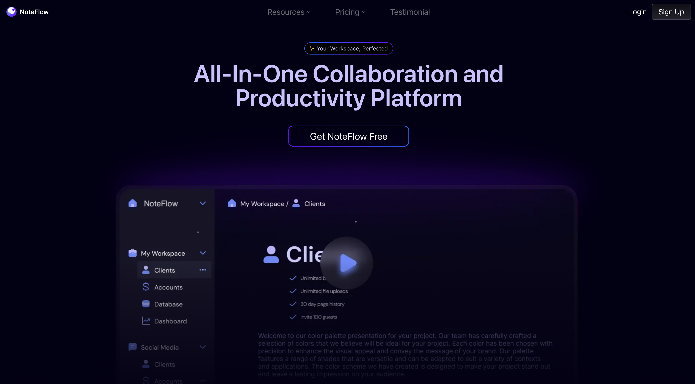

# NoteFlow - Real-Time Text Editor

NoteFlow is a real-time text editor built using Next.js, TypeScript, Prisma, PostgreSQL, NextAuth, and Socket.io. It enables users to collaborate in real-time with rich customization features.

## Features

- **Three Workspaces:**
  - **Private:** Personal workspace for individual users.
  - **Shared:** Collaborative workspace where users can share documents and edit in real-time.
  - **Collaborating:** Workspace for users with whom it has been shared
- **Customization:**
  - Add banners and custom emojis.
  - Uses Delta's Quill editor for an enhanced text editing experience.

## Future Scope

- Implementing a pricing structure for premium features.

## Tech Stack

- **Frontend:** Next.js, TypeScript
- **Backend:** Prisma, PostgreSQL
- **Authentication:** NextAuth
- **Real-time Collaboration:** Socket.io

## Screenshots




## Tech Stack Logos


## Getting Started

You can run NoteFlow either directly with npm or using Docker.

### Standard Setup (without Docker)

1. Install dependencies:
```bash
npm install
```

2. Run the development server:
```bash
npm run dev
```

### Docker Setup

1. Make sure Docker is installed on your system
2. Build and run the container:
```bash
docker compose up --build
```

With either method, open [http://localhost:3000](http://localhost:3000) in your browser to see the app in action.

## Learn More

For more information, refer to the following resources:

- [Next.js Documentation](https://nextjs.org/docs)
- [Prisma Documentation](https://www.prisma.io/docs)
- [Neon](https://neon.tech/docs/introduction)
- [NextAuth Documentation](https://next-auth.js.org/)
- [Socket.io Documentation](https://socket.io/)
- [EdgeStore Documentation](https://edgestore.dev/docs/quick-start)